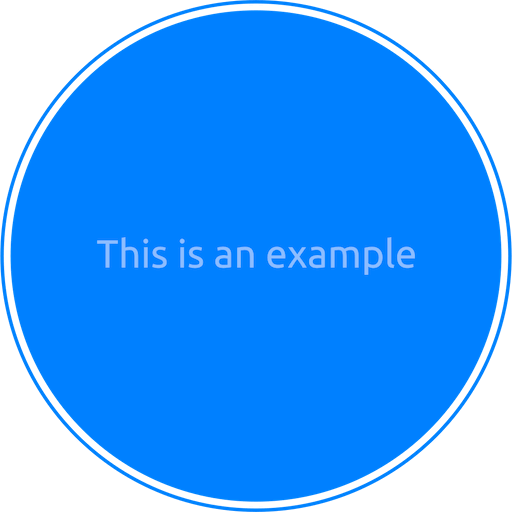

.. .. image:: https://readthedocs.org/projects/cookiecutter-aws-lbd-demo/badge/?version=latest
    :target: https://cookiecutter-aws-lbd-demo.readthedocs.io/en/latest/
    :alt: Documentation Status

.. .. image:: https://github.com/MacHu-GWU/cookiecutter_aws_lbd_demo-project/actions/workflows/main.yml/badge.svg
    :target: https://github.com/MacHu-GWU/cookiecutter_aws_lbd_demo-project/actions?query=workflow:CI

.. .. image:: https://codecov.io/gh/MacHu-GWU/cookiecutter_aws_lbd_demo-project/branch/main/graph/badge.svg
    :target: https://codecov.io/gh/MacHu-GWU/cookiecutter_aws_lbd_demo-project

.. .. image:: https://img.shields.io/pypi/v/cookiecutter-aws-lbd-demo.svg
    :target: https://pypi.python.org/pypi/cookiecutter-aws-lbd-demo

.. .. image:: https://img.shields.io/pypi/l/cookiecutter-aws-lbd-demo.svg
    :target: https://pypi.python.org/pypi/cookiecutter-aws-lbd-demo

.. .. image:: https://img.shields.io/pypi/pyversions/cookiecutter-aws-lbd-demo.svg
    :target: https://pypi.python.org/pypi/cookiecutter-aws-lbd-demo

.. image:: https://img.shields.io/badge/✍️_Release_History!--None.svg?style=social&logo=github
    :target: https://github.com/MacHu-GWU/cookiecutter_aws_lbd_demo-project/blob/main/release-history.rst

.. image:: https://img.shields.io/badge/⭐_Star_me_on_GitHub!--None.svg?style=social&logo=github
    :target: https://github.com/MacHu-GWU/cookiecutter_aws_lbd_demo-project

------

.. .. image:: https://img.shields.io/badge/Link-API-blue.svg
    :target: https://cookiecutter-aws-lbd-demo.readthedocs.io/en/latest/py-modindex.html

.. .. image:: https://img.shields.io/badge/Link-Install-blue.svg
    :target: `install`_

.. image:: https://img.shields.io/badge/Link-GitHub-blue.svg
    :target: https://github.com/MacHu-GWU/cookiecutter_aws_lbd_demo-project

.. image:: https://img.shields.io/badge/Link-Submit_Issue-blue.svg
    :target: https://github.com/MacHu-GWU/cookiecutter_aws_lbd_demo-project/issues

.. .. image:: https://img.shields.io/badge/Link-Request_Feature-blue.svg
    :target: https://github.com/MacHu-GWU/cookiecutter_aws_lbd_demo-project/issues

.. .. image:: https://img.shields.io/badge/Link-Download-blue.svg
    :target: https://pypi.org/pypi/cookiecutter-aws-lbd-demo#files

Welcome to ``cookiecutter_aws_lbd_demo`` Documentation
==============================================================================

About
------------------------------------------------------------------------------

This project is a **simplified** best-practice template for deploying AWS Lambda functions. It is designed for projects that don't need the full complexity of an enterprise-grade deployment pipeline.

We also maintain a production-grade template that includes everything an enterprise team would need (multi-environment, canary deployments, CI/CD pipelines, etc.). However, many projects don't require that level of complexity — this simplified version covers the essentials and gets you up and running quickly.

What's Included
~~~~~~~~~~~~~~~~~~~~~~~~~~~~~~~~~~~~~~~~~~~~~~~~~~~~~~~~~~~~~~~~~~~~~~~~~~~~~~

- **AWS CDK** for infrastructure deployment
- **Unit Tests and Integration Tests**
- **Lambda Layer** support
- **Local script deployment** (no CI/CD pipeline required)
- **Environment variables** managed via Lambda Environment Variables and ``.env`` files

What's Intentionally Left Out
~~~~~~~~~~~~~~~~~~~~~~~~~~~~~~~~~~~~~~~~~~~~~~~~~~~~~~~~~~~~~~~~~~~~~~~~~~~~~~

- **No multi-environment setup** — single environment only
- **No Lambda alias / canary deployment**
- **No private repository dependencies**
- **No GitHub Actions CI/CD** — deploy directly from local scripts
- **No SSM Parameter Store config management** — uses simple Lambda Environment Variables instead

.. _install:

Install
------------------------------------------------------------------------------

``cookiecutter_aws_lbd_demo`` is released on PyPI, so all you need is to:

.. code-block:: console

    $ pip install cookiecutter-aws-lbd-demo

To upgrade to latest version:

.. code-block:: console

    $ pip install --upgrade cookiecutter-aws-lbd-demo
